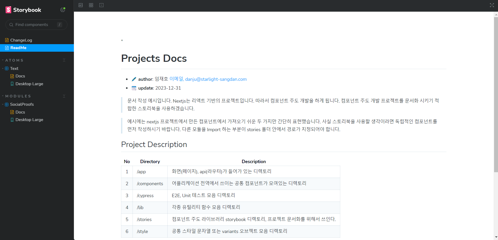

# 뽑히는 포트폴리오 만들기 - for IT 직군

-   **IT 직군에서 제일 중요한 역량은 여러 부서와 협업하는 일입니다. 연차를 막론하고 전체 과정을 고려하거나 도울 수 있는 인재는 반드시 뽑힙니다. '자신이 맡은 부분만 열심히 한다'를 넘어서는 인재들이 되길 바랍니다.**

-   포트폴리오용 웹 어플리케이션 제작을 위한 단순 예시로 봐주세요. 전체 개발 과정을 간략하게나마 보여드리기 위해 만들었습니다. 완성도는 매우 떨어지나 큰 그림을 그리는데 문제 없다고 생각합니다.

<br/>

> 듣기론 처음 개발에 임하시는 분들도 있다 들었습니다. 궁금한 점이 있다면 언제든 물어봐 주세요.

> 제가 알고 있는 모든 지식을 가르쳐 드리겠습니다.

## 예제에서 얻어 가야할 인사이트

-   아 이런식으로 개발하는구나!
-   문서화는 이렇게 하면 되는구나!
-   테스트는 이렇게 하면 되는구나!

## 기획 및 디자인


-   [피그마 링크](https://www.figma.com/file/d1pOk0rxuaGT3ZzKYbQbo0/%EA%B7%B9%EB%8B%A8-%EA%B8%B0%EC%96%B5?type=design&node-id=38%3A4929&mode=design&t=ZStf57oZprBF7xiq-1)

## 웹 어플리케이션 실행하기(개발)


```bash
npm run dev
```

## 개발 문서 실행하기 - Storybook



```bash
npm run storybook
```

## Test 실행하기 - Cypress


```bash
npm run cypress:open
```

## Reference

1. [Nextjs](https://nextjs.org/) - React 기반 풀스택 프레임워크
2. [Reactjs](https://react.dev/) - 자바스크립트 기반 UI를 만들기 위한 라이브러리
3. [Tanstack/ReactQuery](https://tanstack.com/query/latest) - 비동기 상태 관리 라이브러리
4. [Framer-motion](https://www.framer.com/motion/) - 리액트 기반 애니메이션 라이브러리
5. [Shadcn-UI](https://ui.shadcn.com/) - 재활용 가능한 컴포넌트 라이브러리
6. [TailwindCSS](https://tailwindcss.com/) - 유틸리티 클래스 기반 CSS 스타일 라이브러리
7. [Storybook](https://storybook.js.org/) - 컴포넌트 기반 UI개발 문서화 라이브러리
8. [Cypress](https://www.cypress.io/) - 브라우저 기반 자동화 테스팅 프레임워크
